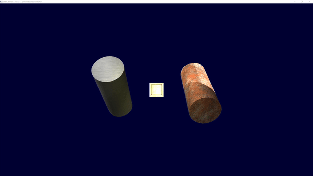
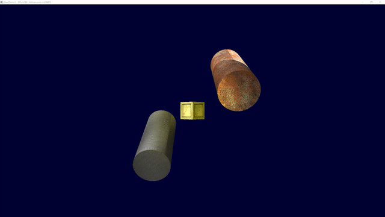
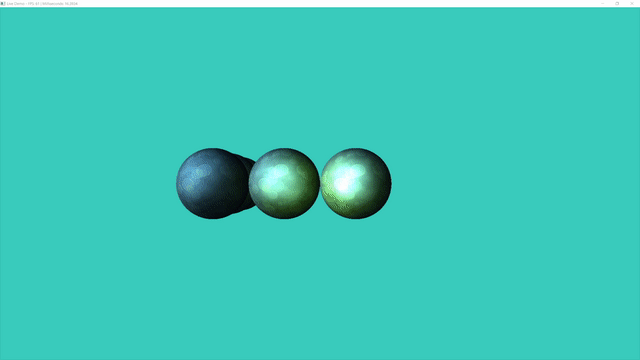
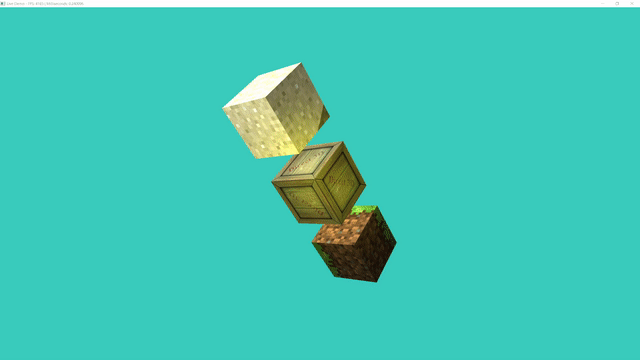
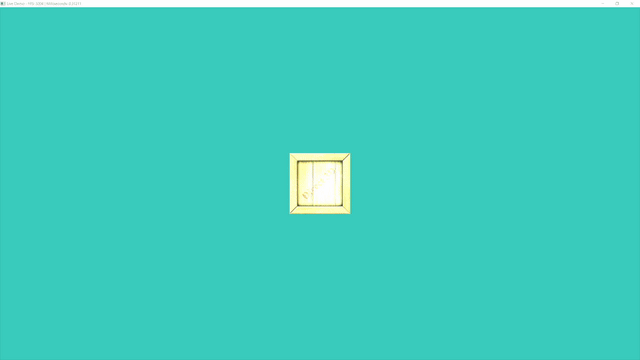

# Dementia

Small 3D engine library in DirectX 11 for Windows. 
It allows you to create scenes using geometrical basic objects like Cubes, Spheres or Cilinders. Also it  has support for three types of lights. Includes support for mouse and keyboard input.

## Documentation

* API Reference -> docs/API_Reference.pdf
* Technical Documentation -> docs/Technical_documentation.pdf
* User manual -> docs/User_manual.pdf 

## Examples

### Example 1 - Basic Usage of the Framework

Basic scene, with some texturized objects with a basic camera controlled by the WASD keys and mouse. You can find the full code example in the **2DemoTexturas1** folder.

### Example 2 - Adding rotation to the previous example

Basic scene, with some texturized objects with a basic camera controlled by the WASD keys and mouse. The objects rotates using time and the rotation functions of Dementia. You can find the full code example in the **3DemoTexturasRotacion1** folder.

### Example 3 - Lights

Basic scene, showing how the lights of the framework works. You can find the full code example in the **5DemoLuces1** folder.

### Example 4 - Performance

A scene with 10.000 boxes, showing the performance of the framework. Achiving 250+ FPS with a NVIDIA G-force 2080ti. You can try with other geometries as well. The limits are more in the CPU than the GPU. You can find the full code example in the **6DemoRendimientoCajas** folder.

### Example 5 - Scaling

Basic scene, showing how scaling works. You can find the full code example in the **7Escalado** folder.

### Example 6 - Rotation

Basic scene, showing how rotation works. You can find the full code example in the **8Rotacion** folder.

### Example 7 - Complete animated scene

A complete scene showing all the functionalities of the framework. You can find the full code example in the **9Metamorfosis** folder.

## Contributors

* [Pheenoom](https://github.com/rbagan)